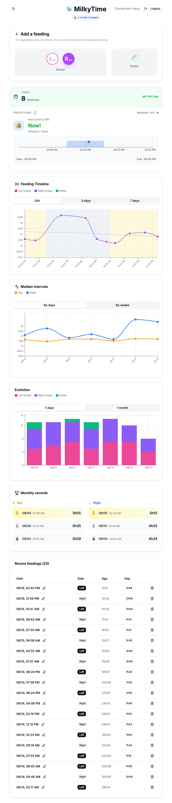

# MilkyTime 🍼

Next.js application for tracking baby feedings with authentication, advanced statistics and smart alerts.

## ✨ Features

- 🔐 **Multi-user authentication**
- 📊 **Detailed statistics** (median/average intervals)
- 📈 **Interactive charts** (day/night, evolution)
- 🏆 **Records system** with notifications
- 🚨 **Smart alerts** (predictions, cluster feeding)
- 📱 **Responsive interface** with dark mode
- 🧪 **Complete Playwright tests**

## 🚀 Quick Start

### 1. **Initial setup (first time)**
```bash
git clone <your-repo>
cd mon-app-tetees
make init
# Edit .env.local with your real values
make start
```

### 2. **Daily development**
```bash
make dev          # http://localhost:3000
```

### 3. **Testing (Secure)**
```bash
npm run test:setup    # Verify test configuration
make test-ui          # Visual test mode
make test             # All tests in CLI
```

🛡️ Tests are **automatically isolated** and use your `.env.test` database

### 4. **Production (Docker)**
```bash
make docker       # http://localhost:3000
make docker-logs  # View logs
```

## ⚙️ Configuration

### 🔧 **Development Environment**

Copy `.env.example` to `.env.development`:

```bash
# Supabase (production database)
NEXT_PUBLIC_SUPABASE_URL=https://your-project.supabase.co
NEXT_PUBLIC_SUPABASE_ANON_KEY=your_production_key
```

Users are stored directly in Supabase. Seed the table `app_users` with hashed passwords, for example:

```sql
insert into app_users (username, password_hash, baby_birth_date)
values ('<USERNAME>>', '<HASH>', '<BABY_BIRTH_DATE>');
```

Use `npx bcryptjs-cli hash "your-password"` (or any other bcrypt helper) to generate `<HASH>`.

### 🧪 **Testing Environment (Secure)**

Copy `env.test.example` to `.env.test`:

```bash
# Supabase (SEPARATE test database - CRITICAL!)
NEXT_PUBLIC_SUPABASE_URL=https://your-TEST-project.supabase.co
NEXT_PUBLIC_SUPABASE_ANON_KEY=your_test_key
```

Playwright fixtures automatically upsert the default `test` user into `app_users`. Make sure the table exists (see `scripts/database.sql`).

⚠️ **IMPORTANT:** Always use a **separate Supabase project** for tests to avoid data loss!

### 🚀 **Deployment Configuration**

Add to your `~/.zshrc` (personal, not versioned):

```bash
# Deployment variables for milkyTime
export SERVER_USER=your_user
export SERVER_HOST=your-server.com
export APP_PATH=/path/to/your/app
```

Then reload: `source ~/.zshrc`

## 🛠️ Available commands

```bash
make help        # Show all commands
make init        # Initial setup (first time)
make start       # Start the project
make dev         # Development server
make build       # Production build
make test        # All tests
make test-ui     # Tests in visual mode
make docker      # Run with Docker
make deploy      # Deploy to server
make clean       # Clean everything
```

## 🏗️ Tech stack

- **Framework:** Next.js 15 (App Router)
- **Language:** TypeScript
- **Styling:** Tailwind CSS + shadcn/ui
- **Database:** Supabase
- **Charts:** Recharts
- **Testing:** Playwright
- **Deployment:** Docker + Docker Compose

## 🛡️ Test Security Architecture

This project implements **triple-layer protection** to prevent test data from corrupting production:

### ✅ **Automatic Protections:**
1. **Environment Isolation:** `NODE_ENV=test` automatically loads `.env.test`
2. **Code Guards:** Tests fail immediately if production URLs are detected
3. **Keyword Detection:** URLs with 'prod', 'production', 'live' are blocked

### ✅ **File Separation:**
- `.env.development` → Development database
- `.env.test` → **Separate test database** (never the same as production!)
- `~/.zshrc` → Deployment variables (infrastructure, not app data)

### ✅ **Safe Test Commands:**
```bash
npm run test:setup     # Validate test environment before running tests
npm run test:auth      # Individual test suites
make test-ui          # Full UI test suite
```

**Result:** Tests can NEVER access production data, even with configuration errors.

## 📁 Project structure

```
mon-app-tetees/
├── app/                 # Next.js pages (App Router)
├── components/          # React components + UI
├── lib/                 # Utilities & shared helpers
├── src/hooks/           # Hooks métier (ex: useFoodTracker)
├── src/services/        # Services (ex: feedingService)
├── tests/               # Playwright tests
├── public/              # Static assets
├── scripts/             # SQL scripts
├── Makefile             # Development commands
├── Dockerfile           # Docker configuration
└── .env.example         # Configuration template
```

## 🧱 Application architecture

- `src/services/feedingService.ts`: single entry point for Supabase queries and data aggregation (daily stats, interval processing, records). The service returns typed objects that can be reused by hooks or tests.
- `src/hooks/useFoodTracker.ts`: orchestrates authentication, data loading, record handling and smart alerts, and exposes the values/actions the UI needs.
- `app/page.tsx`: presentation layer that consumes the hook and wires the sub-components (AddFeedingPanel, TodayAndSmartCards, timelines, etc.).

### ✅ Recent improvements

- Introduced `FoodTrackerContext` to remove heavy prop drilling and let child components consume only what they need.
- Strengthened typing for the visualisation components (timelines/charts) so they consume the service types without casts.

### 🔭 Suggested next steps

- Break `useFoodTracker` into focused hooks (`useAuthTracker`, `useFeedingData`, `useRecordsNotifications`, …) to honour the single-responsibility principle and ease unit testing.

### Screenshot


